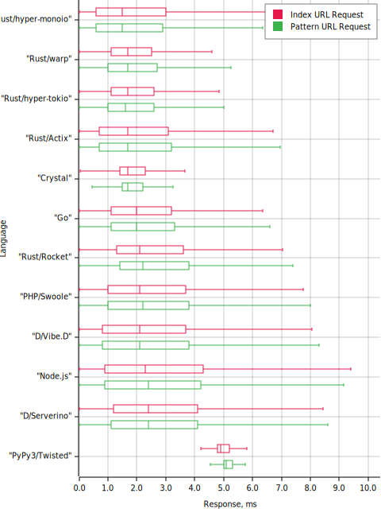

= Simple Web Benchmark
:doctype: book
:pp: {plus}{plus}
:toc:

A simple web benchmark of C{pp}, Crystal, D, Go, Java, Node.js, PHP, Python, Ruby, Rust and Scala.

== Results

== Testing

The stats gathered by the https://github.com/rakyll/hey[hey] tool (please run it twice for
the JIT optimizations where it's applicable):

 hey -n 50000 -c 256 -t 10 "http://127.0.0.1:3000/"
 hey -n 50000 -c 256 -t 10 "http://127.0.0.1:3000/greeting/hello"

=== Using Docker

Build the image:

 $ docker build suite/ -t simple-web-benchmark

Enter the shell in the image:

 $ docker run -it --rm -v $(pwd):/src --network="host" simple-web-benchmark

There is a `Makefile` that could be used to simlify Docker usage:

* `make build` (build the image);
* `make shell` (enter the shell in the image).

Please note that the `make shell` rule requires `cpupower` utility installed
that is invoked with `sudo` to set cpufreq's performance governon
(it runs the CPU at the maximum frequence to eliminate throttling issues).

=== Automation

Please use the Rust program to run the tests automatically:

....
USAGE:
    cargo run --manifest-path suite/Cargo.toml -- [FLAGS] [OPTIONS] <lang>...

FLAGS:
    -h, --help       Prints help information
    -V, --version    Prints version information
        --verbose    Enables the verbose output

OPTIONS:
    -o, --out <file>    Sets an image file to generate (result.svg by default, PNG/SVG/TSV are supported)

ARGS:
    <lang>...    Sets the languages to test ('all' for all)

The following languages are supported: cpp, crystal, dmd, go, java, ldc2, nodejs, php, python, rust_actix, rust_hyper, rust_rocket, rust_tide, rust_warp, scala.
....

And another program to get the versions of the languages:

 $ cargo run --manifest-path suite/Cargo.toml --bin versions

The same `Makefile` is used to run those programs (but the commands should be run from within the Docker image shell):

* `make run` (run all tests);
* `make versions` (get the versions of the languages).

== Usage

=== Go

 go run go/main.go
 go run go/main.go --port=8000

=== Crystal

Using https://crystal-lang.org/reference/installation/[Crystal]:

 crystal run --release --no-debug crystal/server.cr
 crystal run --release --no-debug crystal/server.cr -- --port=8000

=== Rust

Please install https://github.com/rust-lang/rustup.rs#working-with-nightly-rust[Nightly Rust].

Sample applications use
https://hyper.rs[hyper] HTTP library,
https://rocket.rs/[Rocket],
https://crates.io/crates/tide[Tide],
https://crates.io/crates/warp[warp] and
https://actix.rs/[Actix] web frameworks:

 cargo run --manifest-path rust/hyper/Cargo.toml --release
 cargo run --manifest-path rust/hyper/Cargo.toml --release -- --port=8000

 cargo run --manifest-path rust/rocket/Cargo.toml --release
 cargo run --manifest-path rust/rocket/Cargo.toml --release -- --port=8000

 cargo run --manifest-path rust/tide/Cargo.toml --release
 cargo run --manifest-path rust/tide/Cargo.toml --release -- --port=8000

 cargo run --manifest-path rust/warp/Cargo.toml --release
 cargo run --manifest-path rust/warp/Cargo.toml --release -- --port=8000

 cargo run --manifest-path rust/actix-web/Cargo.toml --release
 cargo run --manifest-path rust/actix-web/Cargo.toml --release -- --port=8000

=== D

Two compilers are tested:

* DMD (a reference D compiler);
* https://github.com/ldc-developers/ldc#installation[LDC] (LLVM-based D compiler).
If ldc2 executable is not in path, please use the fully qualified path name.

Uses https://vibed.org/[vibe.d] framework:

 dub run --root=d --compiler=dmd --build=release --config=dmd
 dub run --root=d --compiler=dmd --build=release --config=dmd -- --port=8000

 dub run --root=d --compiler=ldc2 --build=release --config=ldc
 dub run --root=d --compiler=ldc2 --build=release --config=ldc -- --port=8000

=== Scala

Uses https://akka.io/[Akka] toolkit:

 make -C scala clean run
 make PORT=8000 -C scala clean run

=== Node.js

 node nodejs/main.js
 node nodejs/main.js --port=8000

=== PHP

Uses standalone web server and https://www.swoole.co.uk/[Swoole] extension:

 php -q -S 127.0.0.1:3000 php/bare/main.php
 php -q -S 127.0.0.1:8000 php/bare/main.php

 php -c php/swoole/php.ini php/swoole/main.php
 php -c php/swoole/php.ini php/swoole/main.php --port=8000

=== Python

Uses standalone web server and https://twistedmatrix.com/trac/[Twisted] engine:

 python3 python/main.py
 python3 python/main.py --port=8000

 pypy3 python/twist.py
 pypy3 python/twist.py --port=8000

Please note that CPython has the performance problems running as a standalone server, so we've used PyPy3. To install Twisted please use the pip module:

 pypy3 -m ensurepip
 pypy3 -m pip install twisted

=== Java

Uses https://spring.io/projects/spring-boot[Sprint Boot] project:

 make -C java clean run
 make PORT=8000 -C java clean run

=== C{pp}

Uses link:www.boost.org/libs/beast[Boost.Beast] library:

 make -C cpp clean run
 make PORT=8000 -C cpp clean run

=== Ruby

Use https://rubyonrails.org/[Ruby on Rails] framework:

 ruby --jit ruby/inline-rails.rb
 ruby --jit ruby/inline-rails.rb --port=8000

Requires https://bundler.io/[bundler] installation:

 gem install bundler

== Environment

CPU: Intel(R) Core(TM) i7-10710U, Mem: 16GB LPDDR3 2133MHz

Base Docker image: Debian GNU/Linux bullseye/sid

|===
| Language | Version

| C{pp}/g{pp}
| 10.2.1

| Crystal
| 1.1.0

| DMD
| v2.097.1

| Go
| go1.16.6

| Java
| 16.0.2

| LDC
| 1.26.0

| Node.js
| v16.5.0

| PHP
| 7.4.21

| PyPy
| 7.3.5-final0 for Python 3.7.10

| Ruby
| 2.7.4p191

| Rust
| 1.56.0-nightly

| Scala
| 3.0.1
|===
